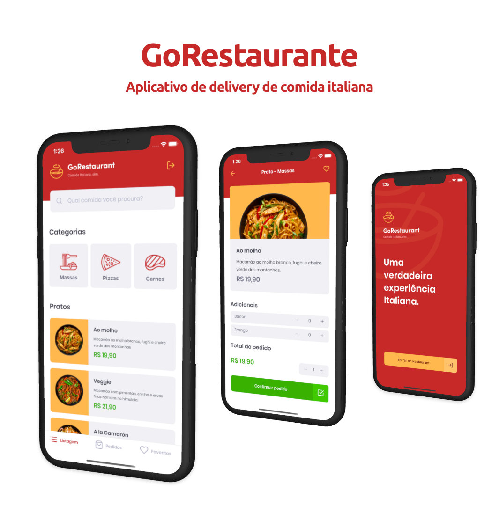

 <h3 align="center"> 

</h3>

## :computer: Project

GoRestaurant is a React Native application using TypeScript that allows the customer to place orders, save as favorite and view previous orders.

  

## :rocket: Built with

This project was developed with the following technologies:

- [React Native](https://facebook.github.io/react-native/)
- [TypeScript](https://github.com/microsoft/TypeScript)
- [Context API](https://reactjs.org/docs/context.html)
- [Styled-components](https://www.styled-components.com/)
- [Json Server](https://github.com/typicode/json-server)
- [React Navigation](https://reactnavigation.org/)
- [React Native Vector Icons](https://github.com/oblador/react-native-vector-icons)
- [Axios](https://github.com/axios/axios)
- [ESLint](https://eslint.org/)
- [Prettier](https://prettier.io/)
- [VS Code](https://code.visualstudio.com/)

## :mailbox_with_mail: Get in touch!

&nbsp;&nbsp;&nbsp;
&nbsp;&nbsp;&nbsp;

---

Made with :coffee: and ❤️ by Deusdete Filho.
